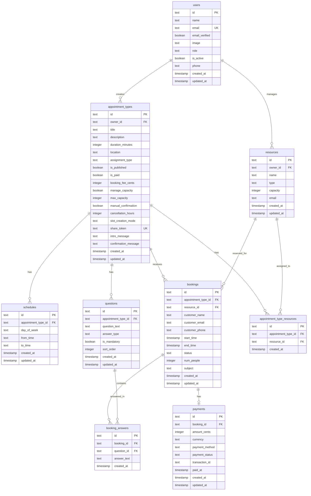

# Appointment Booking System - Database Schema

---

## Entity Relationship Diagram



---

## Tables & Fields

### 1. `users`

User accounts with role-based access (Customer, Admin, Organiser).

| Field | Type | Constraints | Description |
|-------|------|-------------|-------------|
| `id` | TEXT | PRIMARY KEY | Unique identifier |
| `name` | TEXT | NOT NULL | Full name |
| `email` | TEXT | NOT NULL, UNIQUE | Email address |
| `email_verified` | BOOLEAN | DEFAULT false | Email verification status |
| `image` | TEXT | NULLABLE | Profile image URL |
| `role` | TEXT | NOT NULL, DEFAULT 'customer' | **'customer' \| 'admin' \| 'organiser'** |
| `is_active` | BOOLEAN | DEFAULT true | Account activation status |
| `phone` | TEXT | NULLABLE | Phone number |
| `created_at` | TIMESTAMP | DEFAULT NOW | Creation timestamp |
| `updated_at` | TIMESTAMP | DEFAULT NOW | Last update timestamp |

**User Roles:**
- `customer` - End users who book appointments
- `admin` - System administrators (user/provider management, reports)
- `organiser` - Service providers who create and manage appointments

---

### 2. `sessions`

User session management for authentication.

| Field | Type | Constraints | Description |
|-------|------|-------------|-------------|
| `id` | TEXT | PRIMARY KEY | Session identifier |
| `user_id` | TEXT | NOT NULL, FK → users.id | Reference to user |
| `token` | TEXT | NOT NULL, UNIQUE | Session token |
| `expires_at` | TIMESTAMP | NOT NULL | Session expiry time |
| `ip_address` | TEXT | NULLABLE | Client IP address |
| `user_agent` | TEXT | NULLABLE | Client user agent |
| `created_at` | TIMESTAMP | DEFAULT NOW | Creation timestamp |
| `updated_at` | TIMESTAMP | DEFAULT NOW | Last update timestamp |

---

### 3. `accounts`

OAuth/credential account links.

| Field | Type | Constraints | Description |
|-------|------|-------------|-------------|
| `id` | TEXT | PRIMARY KEY | Account identifier |
| `user_id` | TEXT | NOT NULL, FK → users.id | Reference to user |
| `account_id` | TEXT | NOT NULL | Provider account ID |
| `provider_id` | TEXT | NOT NULL | Auth provider name |
| `access_token` | TEXT | NULLABLE | OAuth access token |
| `refresh_token` | TEXT | NULLABLE | OAuth refresh token |
| `access_token_expires_at` | TIMESTAMP | NULLABLE | Token expiry |
| `refresh_token_expires_at` | TIMESTAMP | NULLABLE | Refresh token expiry |
| `scope` | TEXT | NULLABLE | OAuth scopes |
| `password` | TEXT | NULLABLE | Hashed password |
| `created_at` | TIMESTAMP | DEFAULT NOW | Creation timestamp |
| `updated_at` | TIMESTAMP | DEFAULT NOW | Last update timestamp |

---

### 4. `verifications`

OTP/email verification records.

| Field | Type | Constraints | Description |
|-------|------|-------------|-------------|
| `id` | TEXT | PRIMARY KEY | Verification identifier |
| `identifier` | TEXT | NOT NULL | Email/phone to verify |
| `value` | TEXT | NOT NULL | OTP code/verification token |
| `expires_at` | TIMESTAMP | NOT NULL | Expiry time |
| `created_at` | TIMESTAMP | DEFAULT NOW | Creation timestamp |
| `updated_at` | TIMESTAMP | DEFAULT NOW | Last update timestamp |

---

### 5. `appointment_types`

Master configuration for appointment types/services.

| Field | Type | Constraints | Description |
|-------|------|-------------|-------------|
| `id` | TEXT | PRIMARY KEY | Unique identifier |
| `owner_id` | TEXT | NOT NULL, FK → users.id | Organiser who created this |
| `title` | TEXT | NOT NULL | Service name (e.g., "Dental Care") |
| `description` | TEXT | NULLABLE | Detailed description |
| `duration_minutes` | INTEGER | NOT NULL, DEFAULT 30 | Duration (30, 45, 60 min) |
| `location` | TEXT | NULLABLE | Venue (NULL = online) |
| `assignment_type` | TEXT | DEFAULT 'automatic' | **'automatic' \| 'by_visitor'** |
| `is_published` | BOOLEAN | DEFAULT false | Published to website |
| `is_paid` | BOOLEAN | DEFAULT false | Requires advance payment |
| `booking_fee_cents` | INTEGER | NULLABLE | Fee in cents |
| `manage_capacity` | BOOLEAN | DEFAULT false | Enable capacity management |
| `max_capacity` | INTEGER | DEFAULT 1 | Max bookings per slot |
| `manual_confirmation` | BOOLEAN | DEFAULT false | Require manual approval |
| `cancellation_hours` | INTEGER | DEFAULT 1 | Hours before for cancellation |
| `slot_creation_mode` | TEXT | DEFAULT 'automatic' | **'automatic' \| 'manual'** |
| `share_token` | TEXT | UNIQUE, NULLABLE | Token for sharing unpublished appointments |
| `intro_message` | TEXT | NULLABLE | Introduction page message |
| `confirmation_message` | TEXT | NULLABLE | Confirmation page message |
| `created_at` | TIMESTAMP | DEFAULT NOW | Creation timestamp |
| `updated_at` | TIMESTAMP | DEFAULT NOW | Last update timestamp |

---

### 6. `resources`

Bookable users or physical resources.

| Field | Type | Constraints | Description |
|-------|------|-------------|-------------|
| `id` | TEXT | PRIMARY KEY | Unique identifier |
| `owner_id` | TEXT | NOT NULL, FK → users.id | Owner/manager |
| `name` | TEXT | NOT NULL | Resource name |
| `type` | TEXT | NOT NULL | **'user' \| 'resource'** |
| `capacity` | INTEGER | DEFAULT 1 | Resource capacity |
| `email` | TEXT | NULLABLE | Email (for user type) |
| `created_at` | TIMESTAMP | DEFAULT NOW | Creation timestamp |
| `updated_at` | TIMESTAMP | DEFAULT NOW | Last update timestamp |

---

### 7. `appointment_type_resources`

Junction table linking appointments to resources.

| Field | Type | Constraints | Description |
|-------|------|-------------|-------------|
| `id` | TEXT | PRIMARY KEY | Unique identifier |
| `appointment_type_id` | TEXT | NOT NULL, FK | Reference to appointment type |
| `resource_id` | TEXT | NOT NULL, FK | Reference to resource |
| `created_at` | TIMESTAMP | DEFAULT NOW | Creation timestamp |

---

### 8. `schedules`

Weekly availability schedule (working hours).

| Field | Type | Constraints | Description |
|-------|------|-------------|-------------|
| `id` | TEXT | PRIMARY KEY | Unique identifier |
| `appointment_type_id` | TEXT | NOT NULL, FK | Reference to appointment type |
| `day_of_week` | TEXT | NOT NULL | Monday, Tuesday, etc. |
| `from_time` | TEXT | NOT NULL | Start time "HH:MM" |
| `to_time` | TEXT | NOT NULL | End time "HH:MM" |
| `created_at` | TIMESTAMP | DEFAULT NOW | Creation timestamp |
| `updated_at` | TIMESTAMP | DEFAULT NOW | Last update timestamp |

---

### 9. `questions`

Custom questions for booking forms.

| Field | Type | Constraints | Description |
|-------|------|-------------|-------------|
| `id` | TEXT | PRIMARY KEY | Unique identifier |
| `appointment_type_id` | TEXT | NOT NULL, FK | Reference to appointment type |
| `question_text` | TEXT | NOT NULL | Question to ask |
| `answer_type` | TEXT | NOT NULL | 'single_line' \| 'multi_line' \| 'phone' \| 'radio' \| 'checkbox' |
| `is_mandatory` | BOOLEAN | DEFAULT false | Required field |
| `sort_order` | INTEGER | DEFAULT 0 | Display order |
| `created_at` | TIMESTAMP | DEFAULT NOW | Creation timestamp |
| `updated_at` | TIMESTAMP | DEFAULT NOW | Last update timestamp |

---

### 10. `bookings`

Customer appointment reservations.

| Field | Type | Constraints | Description |
|-------|------|-------------|-------------|
| `id` | TEXT | PRIMARY KEY | Unique identifier |
| `appointment_type_id` | TEXT | NOT NULL, FK | Reference to appointment type |
| `resource_id` | TEXT | NULLABLE, FK | Assigned resource |
| `customer_name` | TEXT | NOT NULL | Customer's name |
| `customer_email` | TEXT | NOT NULL | Customer's email |
| `customer_phone` | TEXT | NULLABLE | Customer's phone |
| `start_time` | TIMESTAMP | NOT NULL | Appointment start |
| `end_time` | TIMESTAMP | NOT NULL | Appointment end |
| `status` | TEXT | DEFAULT 'request' | **'request' \| 'booked' \| 'cancelled' \| 'completed'** |
| `num_people` | INTEGER | DEFAULT 1 | Number of people (capacity) |
| `subject` | TEXT | NULLABLE | Booking subject |
| `created_at` | TIMESTAMP | DEFAULT NOW | Creation timestamp |
| `updated_at` | TIMESTAMP | DEFAULT NOW | Last update timestamp |

---

### 11. `booking_answers`

Responses to booking questions.

| Field | Type | Constraints | Description |
|-------|------|-------------|-------------|
| `id` | TEXT | PRIMARY KEY | Unique identifier |
| `booking_id` | TEXT | NOT NULL, FK | Reference to booking |
| `question_id` | TEXT | NOT NULL, FK | Reference to question |
| `answer_text` | TEXT | NOT NULL | Customer's answer |
| `created_at` | TIMESTAMP | DEFAULT NOW | Creation timestamp |

---

### 12. `payments`

Payment records for paid bookings.

| Field | Type | Constraints | Description |
|-------|------|-------------|-------------|
| `id` | TEXT | PRIMARY KEY | Unique identifier |
| `booking_id` | TEXT | NOT NULL, UNIQUE, FK | Reference to booking |
| `amount_cents` | INTEGER | NOT NULL | Amount in cents |
| `currency` | TEXT | DEFAULT 'INR' | Currency code |
| `payment_method` | TEXT | NULLABLE | 'credit_card' \| 'debit_card' \| 'upi' \| 'paypal' |
| `payment_status` | TEXT | DEFAULT 'pending' | 'pending' \| 'completed' \| 'failed' \| 'refunded' |
| `transaction_id` | TEXT | NULLABLE | External transaction ID |
| `paid_at` | TIMESTAMP | NULLABLE | Payment completion time |
| `created_at` | TIMESTAMP | DEFAULT NOW | Creation timestamp |
| `updated_at` | TIMESTAMP | DEFAULT NOW | Last update timestamp |

---

## Requirements Coverage

| PDF Requirement | Database Support |
|-----------------|------------------|
| ✅ User Roles (Customer, Admin, Organiser) | `users.role` |
| ✅ Authentication (email/password) | `users`, `accounts`, `sessions` |
| ✅ OTP Verification | `verifications` table |
| ✅ Forgot Password | `verifications` table |
| ✅ Activate/Deactivate Accounts | `users.is_active` |
| ✅ Create Appointment Types | `appointment_types` |
| ✅ Share Unpublished Appointments | `appointment_types.share_token` |
| ✅ Define Duration | `appointment_types.duration_minutes` |
| ✅ User/Resource Assignment | `resources.type`, `assignment_type` |
| ✅ Working Hours / Weekly Schedule | `schedules` table |
| ✅ Custom Questions | `questions` table |
| ✅ Publish/Unpublish | `appointment_types.is_published` |
| ✅ Max Bookings Per Slot | `appointment_types.max_capacity` |
| ✅ Advance Payment | `appointment_types.is_paid`, `payments` |
| ✅ Manual Confirmation | `appointment_types.manual_confirmation` |
| ✅ Slot Creation Mode | `appointment_types.slot_creation_mode` |
| ✅ Manage Capacity | `appointment_types.manage_capacity` |
| ✅ Booking with Status | `bookings.status` |
| ✅ Profile (Upcoming/Past Appointments) | `bookings` with `start_time` filter |

---

## Indexes (Recommended)

```sql
CREATE INDEX idx_users_role ON users(role);
CREATE INDEX idx_users_active ON users(is_active);
CREATE INDEX idx_appointment_types_owner ON appointment_types(owner_id);
CREATE INDEX idx_appointment_types_published ON appointment_types(is_published);
CREATE INDEX idx_schedules_appointment ON schedules(appointment_type_id);
CREATE INDEX idx_bookings_appointment ON bookings(appointment_type_id);
CREATE INDEX idx_bookings_status ON bookings(status);
CREATE INDEX idx_bookings_start_time ON bookings(start_time);
CREATE INDEX idx_payments_status ON payments(payment_status);
```
